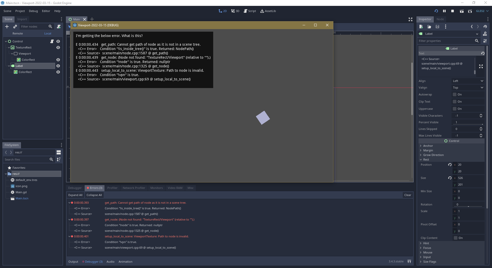

This is a Godot project (created in v3.4.3.stable.official [242c05d12]) to demonstrate how I'm getting bugs logged when using a viewport texture.



```
E 0:00:00.434   get_path: Cannot get path of node as it is not in a scene tree.
  <C++ Error>   Condition "!is_inside_tree()" is true. Returned: NodePath()
  <C++ Source>  scene/main/node.cpp:1587 @ get_path()
E 0:00:00.439   get_node: (Node not found: "TextureRect/Viewport" (relative to "").)
  <C++ Error>   Condition "!node" is true. Returned: nullptr
  <C++ Source>  scene/main/node.cpp:1325 @ get_node()
E 0:00:00.443   setup_local_to_scene: ViewportTexture: Path to node is invalid.
  <C++ Error>   Condition "!vpn" is true.
  <C++ Source>  scene/main/viewport.cpp:69 @ setup_local_to_scene()
```

Despite these messages the application can be exported and it works, even as a non-debug build.
